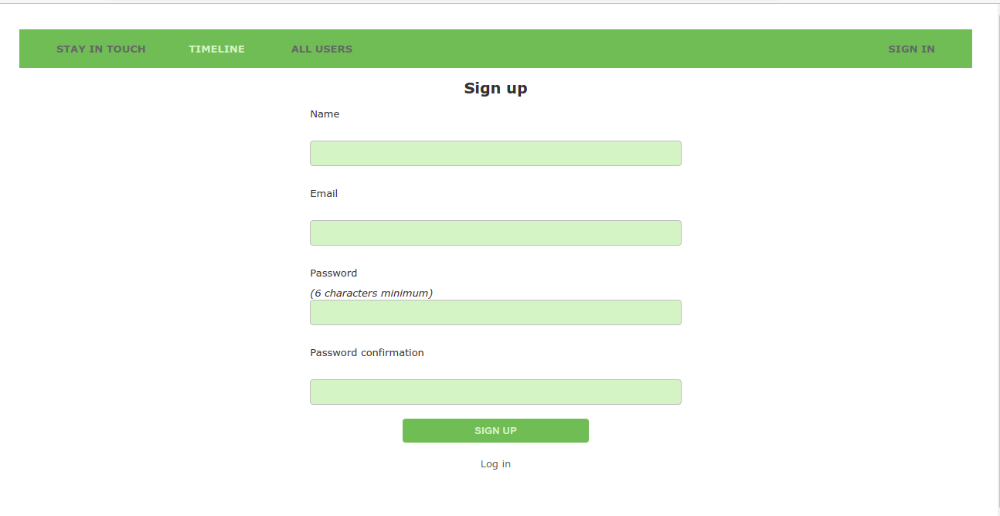
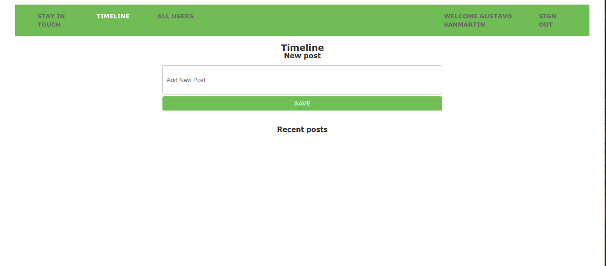
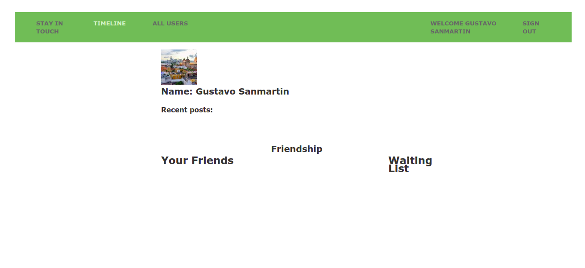

# Scaffold for social media app with Ruby on Rails


We create a Ruby on Rails social media app for this project; you can create accounts and log in, guest users only can see, sign-in and sing-up pages.



 If you log in, you will access the list of all users and see each user profile with their posts. 

You could send friends invitations (Add button) and see the pending friends list to accept or reject sent invitations to you. You can create your posts, comments then and like/dislike posts (yours or your friend posts), order by most recent, and counting the numbers of likes and comments.





## Built With

- Ruby v2.7.2
- Ruby on Rails v5.2.4

## Live Demo

[Stay in touch](https://safe-citadel-65091.herokuapp.com/)


## Getting Started

To get a local copy up and running follow these simple example steps.

### Prerequisites

Ruby: 2.6.3
Rails: 5.2.3
Postgres: >=9.5

### Setup

Instal gems with:

```
1 | bundle install
```

Setup database with:

```
   1 | rails db:create
   2 | rails db:migrate
```

### Github Actions

To make sure the linters' checks using Github Actions work properly, you should follow the next steps:

1. On your recently forked repo, enable the GitHub Actions in the Actions tab.
2. Create the `feature/branch` and push.
3. Start working on your milestone as usual.
4. Open a PR from the `feature/branch` when your work is done.


### Usage

Start server with:

```
    1 | rails server
```

Open `http://localhost:3000/` in your browser.

### Run tests

```
    1 | rpsec
```

### Deployment

To deploy it, you can use Heroku. 
1. First you will need a Heroku account and set-up for deployment.
1.1. Go to the [heroku website](https://www.heroku.com/) and create an account using the same email address you used for GitHub and Git.
1.2. Run this command 
  ```
  1 | curl https://cli-assets.heroku.com/install.sh | sh
  ```
1.3. Run this command
  ```
  1 | heroku keys:add
  ```
press y and then Enter, and now, type in the email address you used to create your Heroku account and press Enter. Then, type in the password for your Heroku account. Next, press y and Enter to allow Heroku to upload your public SSH key.
1.4. The terminal may read Invalid credentials provided. Just press any key and the Heroku website will open in your browser. Log in with the information you created your account with, and the terminal will reappear and accept your public SSH key.

2. Once you complete the first step.
2.1. Run this command
``` 
1 | heroku create
```
2.2. Then run
```
1 | git remote
```
Check that you see heroku in the output.
2.3. Push to heroku typing 
```
1 | git push heroku HEAD:master
```
2.4.
And we need to migrate the database to 
Run this command
```
1 | heroku run rails db:migrate
```
2.5. Enjoy this app
```
1 | heroku open
```


## Authors


**Ahmed Amin** :man_technologist:
- GitHub: [@AhmedAmin90](https://github.com/AhmedAmin90)
- LinkedIn: [Ahmed Amin](https://www.linkedin.com/in/web-developer/)

**Gustavo Sanmartin** :bird:
- GitHub: [@gasb150](https://github.com/gasb150)
- LinkedIn: [Gustavo Sanmartin](https://www.linkedin.com/in/gustavsanmartin/)


## 🤝 Contributing

Contributions, issues and feature requests are welcome!

Feel free to check the [issues page](issues/).

## Show your support

Give a ⭐️ if you like this project!

## Acknowledgments

<li>Microverse</li>


## 📝 License

<p>This project is <a href="LICENSE">MIT</a> licensed.</p>

